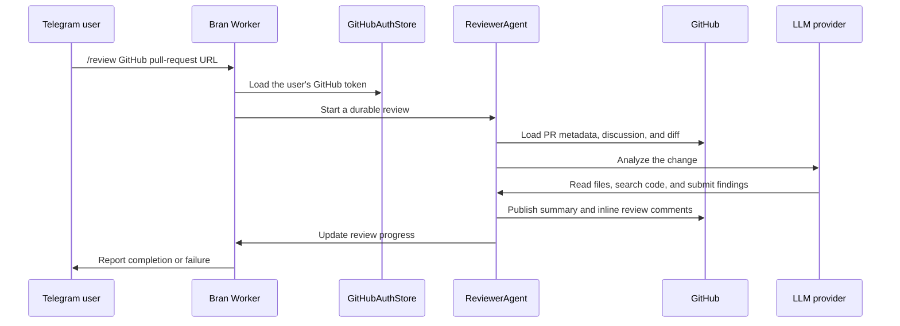

# Bran

Bran is a Telegram bot that reviews GitHub pull requests with an AI coding agent and publishes the result as a native GitHub review. It runs on Cloudflare Workers, stores each Telegram user's GitHub authorization in a SQLite-backed Durable Object, and keeps long-running reviews alive in a separate Durable Object.

## Features

- Connect a GitHub account through OAuth or a personal access token
- Start a pull-request review from a private or group Telegram chat
- Show live review progress in the original Telegram message
- Inspect the pull-request diff and fetch related repository context as needed
- Publish a GitHub review with a summary, inline findings, and suggested changes
- Approve, comment on, or request changes on a pull request directly from Telegram
- Review only changes made since Bran's previous review when possible

Bran currently supports GitHub pull requests only.

## How it works



The Worker receives Telegram webhook requests at its root URL. `GitHubAuthStore` stores account credentials and short-lived OAuth nonces for each Telegram user.

Each review runs in a unique `ReviewerAgent` instance. The instance records progress, keeps the request alive, and deletes its storage when the run ends.

For each review, Bran:

1. Loads the pull request, existing comments and reviews, and the current diff through the GitHub API.
2. Looks for a Bran review marker from an earlier run. If one exists and the commits are comparable, it reviews only the newer changes; otherwise it reviews the full pull request.
3. Excludes generated dependency lockfiles, Markdown files, and test-data directories from the embedded diff.
4. Gives the model bounded tools to read source files, search the repository, inspect a file's diff, and return a structured review.
5. Runs each configured reviewer against the shared snapshot. Bran ignores a failed reviewer when another reviewer succeeds.
6. Sends successful reviews to a separate orchestrator. The orchestrator verifies claims, removes duplicates, and returns one final review.
7. Converts final findings on changed lines into GitHub inline comments. Unplaced findings remain in the summary.
8. Posts `REQUEST_CHANGES` when findings exist. Otherwise, it posts `APPROVE`. It then updates the Telegram progress message.

## Prerequisites

- A Cloudflare account with a Workers subdomain
- Node.js 20 or newer
- [pnpm](https://pnpm.io/) 10 or newer
- A Telegram bot token from [BotFather](https://t.me/BotFather)
- A GitHub OAuth app for the recommended login flow
- An API key for the LLM provider selected by `REVIEW_MODEL`

## Setup

### 1. Install the project

```bash
git clone https://github.com/SphericalKat/bran.git
cd bran
corepack enable
pnpm install --frozen-lockfile
```

The install applies the checked-in `@earendil-works/pi-ai` patch through pnpm. Use pnpm rather than npm or Yarn so the dependency tree and patch stay reproducible.

### 2. Create the Telegram bot

Open a chat with BotFather, run `/newbot`, and save the token it returns. The bot uses webhooks, so polling does not need to be enabled.

### 3. Create a GitHub OAuth app

In GitHub, create an OAuth app with these values:

| Setting | Value |
| --- | --- |
| Homepage URL | Your deployed Worker's URL |
| Authorization callback URL | `https://<worker>.<subdomain>.workers.dev/auth/github/callback` |

Save the client ID and generate a client secret. Bran requests the `repo` OAuth scope so it can read and review both public and private repositories available to the user.

The `GITHUB_OAUTH_CLIENT_ID` and `GITHUB_CALLBACK_URL` currently present in `wrangler.jsonc` belong to the original deployment. Replace both before deploying a fork. The callback URL in `wrangler.jsonc` must exactly match the callback configured in the GitHub OAuth app.

### 4. Configure non-secret variables

Edit the `vars` section of `wrangler.jsonc`:

```jsonc
"vars": {
  "GITHUB_OAUTH_CLIENT_ID": "your-github-oauth-client-id",
  "GITHUB_CALLBACK_URL": "https://<worker>.<subdomain>.workers.dev/auth/github/callback",
  "REVIEW_MODELS": "purroxy-kimi/kimi-k3,purroxy-glm/glm-5.2,purroxy/vertex/gemini-3.6-flash,purroxy/openai/gpt-5.6-sol,purroxy-alibaba/qwen3.8-max",
  "REVIEW_ORCHESTRATOR_MODEL": "purroxy/openai/gpt-5.6-sol",
  "REVIEW_MAX_CONCURRENCY": "3",
  "REVIEWER_TIMEOUT_MS": "180000"
}
```

`REVIEW_MODELS` lists the reviewers. `REVIEW_ORCHESTRATOR_MODEL` merges their successful reviews.

Bran ignores failed reviewers and publishes one final review. See [Worker reviewer](docs/worker-reviewer.md) for advanced settings.

### 5. Add production secrets

Authenticate Wrangler first:

```bash
pnpm exec wrangler login
```

Add each secret. Wrangler prompts for its value and does not write it to the repository.

```bash
pnpm exec wrangler secret put TELEGRAM_BOT_TOKEN
pnpm exec wrangler secret put GITHUB_OAUTH_CLIENT_SECRET
pnpm exec wrangler secret put GITHUB_OAUTH_STATE_SECRET
pnpm exec wrangler secret put LLM_API_KEY
```

Use a cryptographically random value of at least 32 bytes for `GITHUB_OAUTH_STATE_SECRET`. For example, generate one with:

```bash
openssl rand -base64 32
```

| Variable | Required | Purpose |
| --- | --- | --- |
| `TELEGRAM_BOT_TOKEN` | Yes | Authenticates calls to the Telegram Bot API |
| `LLM_API_KEY` | Yes | Authenticates calls to the configured model provider |
| `GITHUB_OAUTH_CLIENT_ID` | For OAuth | Identifies the GitHub OAuth app |
| `GITHUB_OAUTH_CLIENT_SECRET` | For OAuth | Exchanges GitHub authorization codes for user tokens |
| `GITHUB_OAUTH_STATE_SECRET` | For OAuth | Signs short-lived OAuth state values |
| `GITHUB_CALLBACK_URL` | For OAuth | Receives GitHub's authorization callback |
| `REVIEW_MODEL` | No | Single-model fallback when `REVIEW_MODELS` is unset |
| `REVIEW_MODELS` | No | Comma-separated reviewer models |
| `REVIEW_ORCHESTRATOR_MODEL` | No | Merges successful reviews; defaults to the first successful reviewer model |
| `REVIEW_MAX_CONCURRENCY` | No | Limits concurrent reviewers to 1–4; defaults to 3 |
| `REVIEWER_TIMEOUT_MS` | No | Limits each request to 10 seconds–10 minutes; defaults to 180 seconds |

OAuth variables are optional only if every user connects with `/token` instead of `/connect`.

### 6. Deploy

```bash
pnpm deploy
```

Wrangler creates the two SQLite-backed Durable Object classes declared in `wrangler.jsonc`. After deployment, verify the health endpoint:

```bash
curl https://<worker>.<subdomain>.workers.dev/
```

The response must be `Bran is running`.

### 7. Register the Telegram webhook

Point Telegram at the deployed Worker:

```bash
read -rs "Telegram bot token: " BRAN_TELEGRAM_TOKEN
echo
curl --request POST \
  "https://api.telegram.org/bot${BRAN_TELEGRAM_TOKEN}/setWebhook" \
  --data-urlencode "url=https://<worker>.<subdomain>.workers.dev/"
```

Confirm the registration:

```bash
curl "https://api.telegram.org/bot${BRAN_TELEGRAM_TOKEN}/getWebhookInfo"
unset BRAN_TELEGRAM_TOKEN
```

The silent prompt keeps the real bot token out of project files and shell history.

## Local development

Create `.dev.vars` for local secrets. This file is ignored by Git:

```dotenv
TELEGRAM_BOT_TOKEN=your-telegram-bot-token
GITHUB_OAUTH_CLIENT_SECRET=your-github-oauth-client-secret
GITHUB_OAUTH_STATE_SECRET=your-random-state-secret
LLM_API_KEY=your-llm-api-key
```

Then start the local Worker:

```bash
pnpm dev
```

Wrangler serves the Worker locally and provides local Durable Object storage. The health endpoint can be tested directly, but Telegram and GitHub OAuth require a public HTTPS URL. To exercise those flows locally, expose the Wrangler port through an HTTPS tunnel, temporarily use its URL for both the Telegram webhook and `GITHUB_CALLBACK_URL`, and update the GitHub OAuth app callback to match.

After changing Cloudflare bindings, regenerate the Worker types:

```bash
pnpm cf-typegen
```

## Telegram commands

Authentication and manual GitHub actions must be run in a private chat with the bot. `/review` can be run in a private or group chat, but the requesting user must already be connected.

| Command | Description |
| --- | --- |
| `/start` | Show the initial usage message |
| `/connect` or `/login` | Start the GitHub OAuth flow |
| `/token <personal-access-token>` | Connect with a GitHub token; Bran attempts to delete the message immediately |
| `/status` | Show the connected GitHub account |
| `/disconnect` or `/logout` | Remove the stored GitHub credentials |
| `/review <pull-request-url>` | Generate and publish an AI review |
| `/comment <pull-request-url> <message>` | Post a GitHub review comment |
| `/approve <pull-request-url> <message>` | Approve a pull request with a message |
| `/requestchanges <pull-request-url> <message>` | Request changes with a message |

The OAuth flow grants the broad `repo` scope. For `/token`, use a token with access only to the repositories Bran needs and permission to read pull requests, read repository contents, and write pull-request reviews.

## Development commands

| Command | Description |
| --- | --- |
| `pnpm dev` | Run the Worker locally with Wrangler |
| `pnpm test` | Run Vitest in watch mode |
| `pnpm exec vitest run` | Run the test suite once |
| `pnpm exec tsc --noEmit` | Type-check the Worker source |
| `pnpm cf-typegen` | Regenerate Cloudflare binding types |
| `pnpm deploy` | Deploy the Worker to Cloudflare |

## Project structure

```text
src/
├── agent/       Durable review orchestration and progress state
├── auth/        GitHub OAuth, callback handling, and credential storage
├── reviewer/    Diff loading, AI agent tools, review validation, and publishing
├── telegram/    Telegram commands, webhook handling, and progress messages
├── env.ts       Runtime bindings and environment variable types
├── github.ts    GitHub connection and review service
└── index.ts     Worker entry point and HTTP routing
test/            Worker, Durable Object, Telegram, GitHub, and reviewer tests
patches/         pnpm dependency patches
wrangler.jsonc   Cloudflare Worker and Durable Object configuration
```

## Security notes

- GitHub access tokens are stored in the `GitHubAuthStore` Durable Object and are deleted when a user runs `/disconnect`.
- OAuth state is HMAC-signed, expires after ten minutes, and uses a single-use nonce.
- The `/token` command is accepted only in a private chat. The bot attempts to delete the message before validating or storing the token and refuses to continue if deletion fails.
- Rotate `TELEGRAM_BOT_TOKEN`, `GITHUB_OAUTH_CLIENT_SECRET`, `GITHUB_OAUTH_STATE_SECRET`, or `LLM_API_KEY` immediately if one is exposed.
- Treat Cloudflare account access and Durable Object data access as sensitive because stored GitHub tokens authorize actions as individual users.

## Troubleshooting

- **`GitHub OAuth is not configured`:** Confirm all four OAuth variables are set and that `GITHUB_CALLBACK_URL` matches the GitHub app exactly.
- **Telegram does not respond:** Check `getWebhookInfo`, verify the Worker URL is HTTPS, and inspect Cloudflare Worker logs with `pnpm exec wrangler tail`.
- **GitHub rejects a review:** Confirm the connected user can access the repository and that the OAuth app or token has permission to write pull-request reviews.
- **The model request fails:** Check `REVIEW_MODEL`, confirm `LLM_API_KEY` belongs to that provider or proxy, and inspect the Worker logs.
- **An inline finding appears only in the summary:** GitHub permits inline comments only on lines represented by the pull-request diff. Bran keeps unplaceable findings in the review summary.

## License

Bran is available under the [MIT License](LICENSE).
